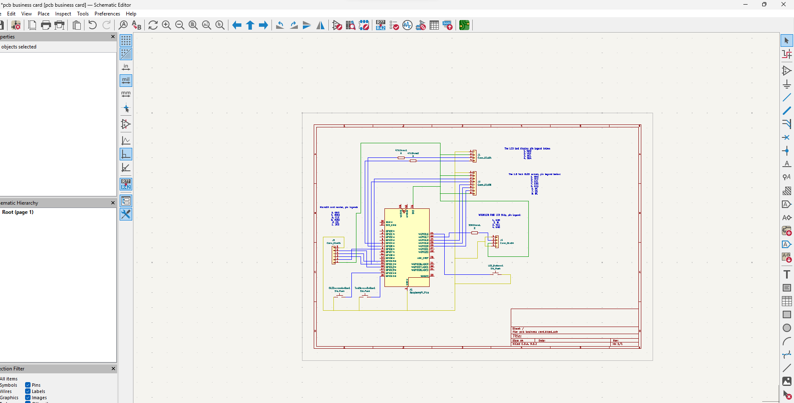
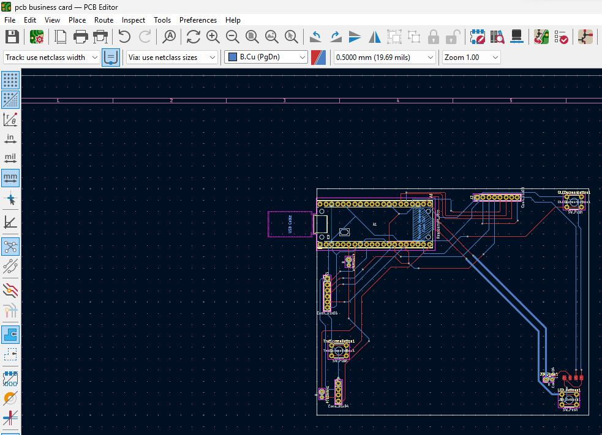
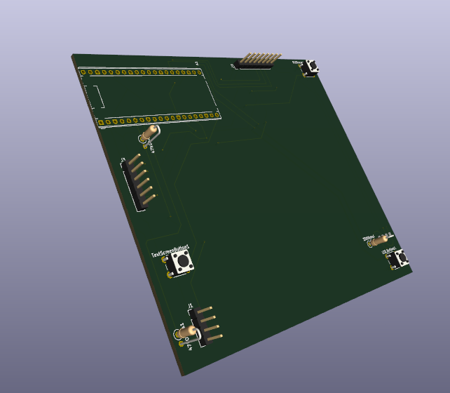

<h2>Night of 2025-07-05:</h2>

So today I looked up some components to use. By now I'm pretty confident with schematics after making schematics for two previous projects. However, this time I need to be careful about the dimensions of my components as I'll need to make a PCB

I also finished my schematics. Chat GPT's always of great help because it knows about all the parts

Not much to be said, it's pretty regular work by now. However, tomorrow I'd need to finish my PCB, which is completely foreign soil that I've not ventured into yet. I'll need ChatGPT and video tutorials to guide me through it.

<h3>TIME: ~3 hours 26 minutes</h3>

<h2>Night of 2025-07-06:</h2>

Finished my PCB. This is my first iteration of it and I'm pretty sure I must've done something wrong. I followed some YouTube tutorials and got ChatGPT to check and guide me through but I just am not sure what I've done wrong (I'm sure there must be something). I asked in highway to see if anyone can spot any errors

Here is the 3D view btw... 

<h3>TIME: ~4 hours</h3>
