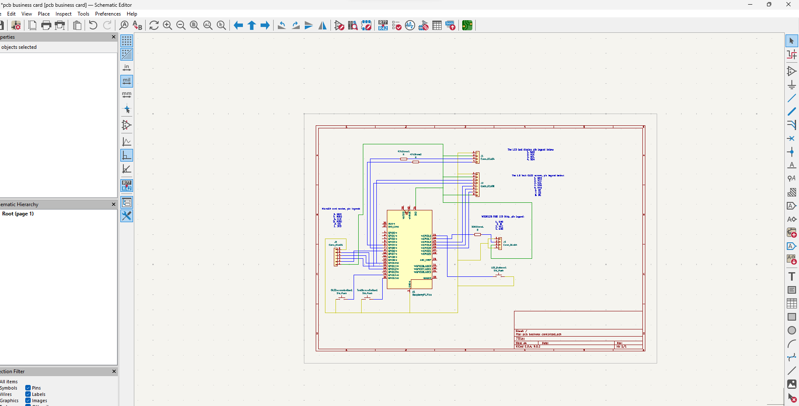
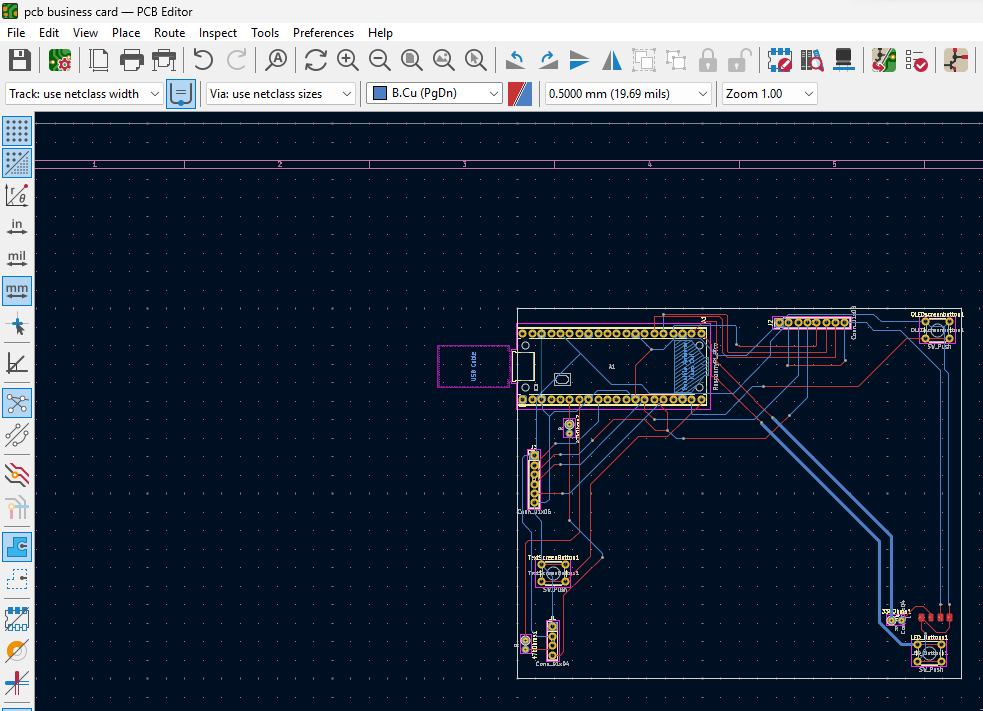
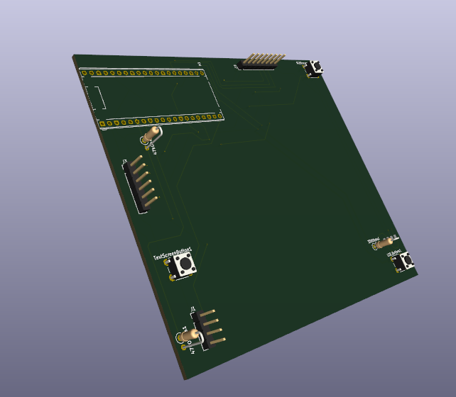
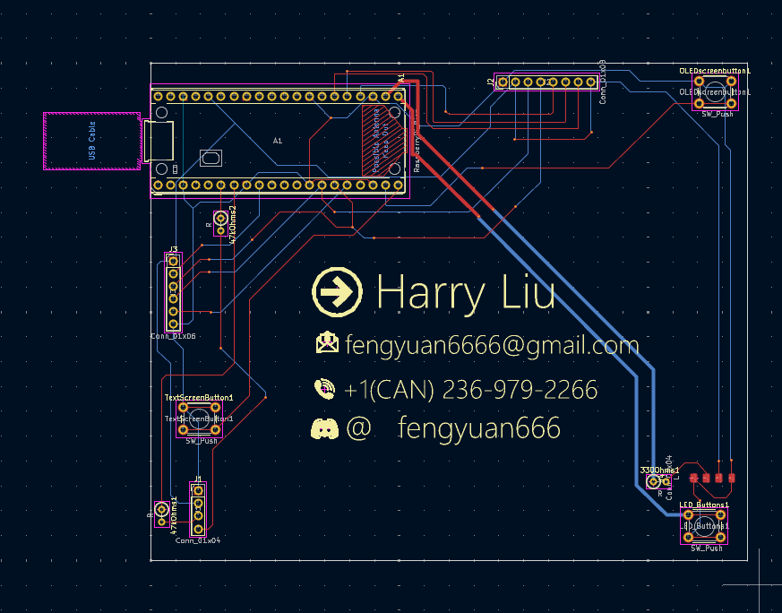
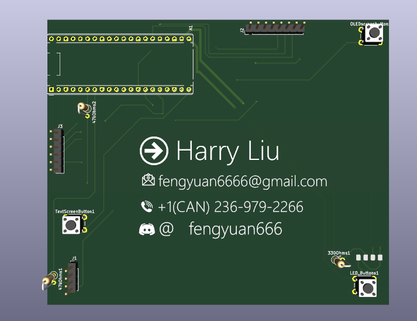
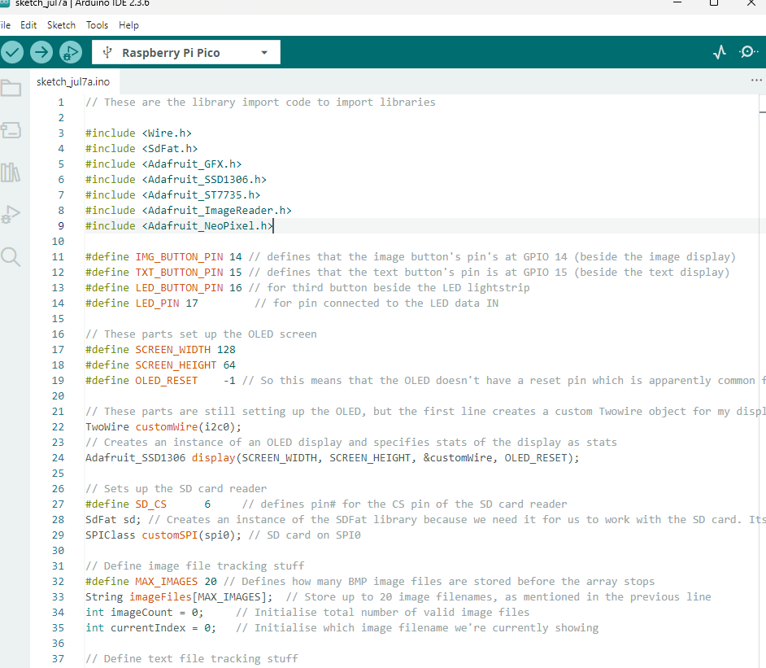
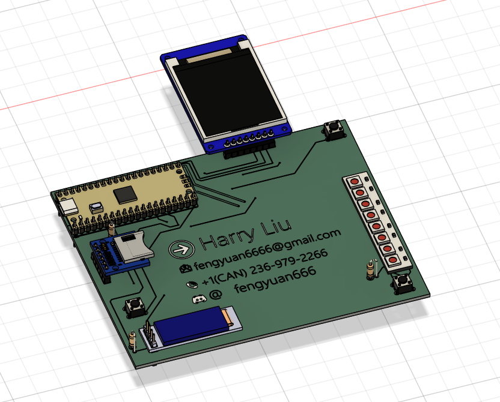

<h2>TOTAL TIME SPENT DURING DESIGN: ~12 hours 41 minutes</h2>

<h2>Night of 2025-07-05:</h2>

So today I looked up some components to use. By now I'm pretty confident with schematics after making schematics for two previous projects. However, this time I need to be careful about the dimensions of my components as I'll need to make a PCB

I also finished my schematics. Chat GPT's always of great help because it knows about all the parts

Not much to be said, it's pretty regular work by now. However, tomorrow I'd need to finish my PCB, which is completely foreign soil that I've not ventured into yet. I'll need ChatGPT and video tutorials to guide me through it.

<h3>TIME: ~3 hours 26 minutes</h3>

<h2>2025-07-06:</h2>

Finished my PCB. This is my first iteration of it and I'm pretty sure I must've done something wrong. I followed some YouTube tutorials and got ChatGPT to check and guide me through but I just am not sure what I've done wrong (I'm sure there must be something). I asked in highway to see if anyone can spot any errors

Here is the 3D view btw... 

<h3>TIME: ~4 hours</h3>

<h2>Night of 2025-07-06:</h2>

I also added silkscreen stuff (text + images on the board), made some minor adjustments & fixes because someone recommended me to lengthen up all wires of the lines which I've only lengthened partially before. Here's how to board looks now:

A 3D render of the PCB also:

I think I'm going to draft out the firmware and then go to sleep... submitting soon.

<h3>TIME: ~34 minutes</h3>

<h2>2025-07-07:</h2>

So the goal here is that because apparently RPI pico only has 2MB of storage I need an external SD card (which I've implemented). So basically there's two file folders, one for the image display and one for the textdisplay. Whenever the RPI pico gets power it will automatically display the first thing in each folder, pressing the button beside each component will rotate through each image in the folder.

Now unfortunately I don't no nothing about micropython (hi this is future Harry the firmware actually apparently needed to be in C++ so don't be confused about that) and my application (SD card -> RPI -> OLED) is very unique. So there doesn't seem to be any online tutorials that I can find. I'm gonna have to ask chatgpt but because vibe coding is not allowed I will let it teach me what each line does, I will write it myself, and I will double check to see if it made errors (make sure that it got my pins right).

Bad news: I forgot to mention that my image display was equiped with a ST7735S and not a SSD1306 chip, so now it assumes that I can't show images. I'd have to change up some parts of the code, hopefully that it doesn't hallucinate...

<h3>TIME: 3 hours 7 minutes</h3>

<h2>2025-07-08:</h2>

The code was finished last night but I forgot to write about it. I think there's no AI mistakes left but I will double check just to make sure

Yep there's no errors, all the pins are correct. I'm working on the README now.

Oh yeah and also I gotta make a 3D model of the PCB with the 3D model of the electronic components attached onto it. 

Okay cool it's done now. Once again, grabCAD saves the day

<h3>TIME: 1 hour 34 minutes</h3>

<h2>2025-07-25:</h2>

Okay quick recap:

My first submission got rejected because it was too big. My second submission got rejected because I forgot to update my readme and journal. So today Im going to be updating the info in my readme and journal to the new dimensions.

Another thing is that I'll have to redo my BOM because Im in China now and things here I can get for a lot cheaper

