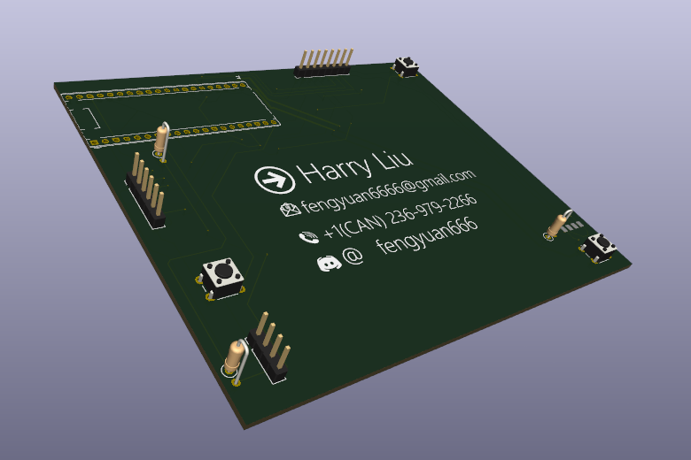
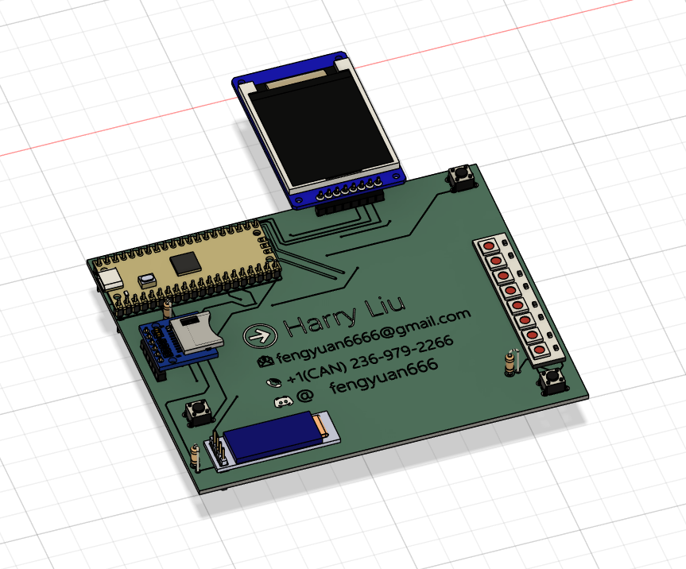
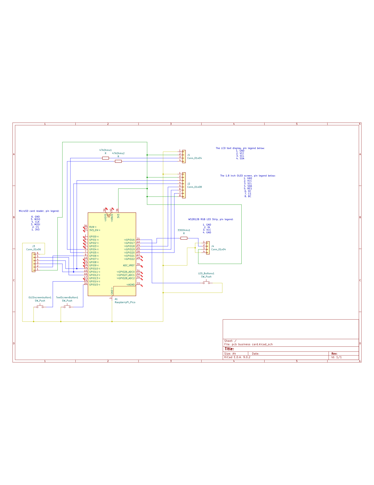

# Flexible PCB card
A PCB business card inspired by Github's, with displays that can adapt to whichever event I attend

<h3>Project Description</h3>

This is a PCB business card with my basic contact info printed on it. It is based off this really cool PCB business card design on Github (I couldn't find the original link :(). Its main feature is its ability to display different things under different contexts. The way it works is simple...

1. There exists an image and a text folder in an external micro SD card
2. Files are stored accordingly into the external micro SD card's folders
3. The displays iterate through the contents in their corresponding folder when their corresponding button is pressed

There's also some cool LED lights to light up the hole thing and grant aura to the otherwise bland-looking information silkscreen. You can toggle them with its own button, too!

The top square display is for images, the bottom is for texts.

<h3>Why I built it</h3>

To be blatantly honest...

**1. To get enough points and get reimbursement my flight**

I feel kinda upset because the price of my flight dropped by like 300 dollars days after I bought it. Also I'm like 2 points away from getting the reimbursement to completely cover my flight...

But at the same time...

**2. It's something that's useful**

A regular PCB business card I find is too generic. A common need I find when attending events is that I sometimes need to display some sort of information. This could look like a QR code when running the next boba drops workshop, or displaying which school you are from during a field trip. Having a PCB card that can display information that can change depending on the event is super helpful because not only does it make you not have to hold up a piece of paper, people would pay more attention at the displayed information because they find it cool.

**2. Unique technical skills involved**

My previous project taught me how to (in an introductory manner) use Kicad's schematic tool and Fusion360's modelling. This project completes the Kicad design process by involving uniquely PCB design and firmware. I think that with these two Highway projects, I would have an introduction to the whole hardware design process.

<h3>Pictures of my project</h3>

<h2>Full 3D model</h2>

PCB Card - no displays + microcontroller

PCB Card - with displays + microcontroller (and yes the 1.8"OLED and SD card receptor looks weird but trust me it's wired correctly in that way)

<h2>Schematics<h2>

**LEGEND:**

Blue = controls

Yellow = grounds

Green = power

<h2>BOM</h2>

|Platform  |Description                   |Price per listed lot|# of parts per listed lot|Lots purchased   |Final price (+shipping), (CAD)|Final price (USD)|Already owned?|Comments                                                          |Link                                                                                                                                                                                                                                                                                                                                                                                                                                                                                                                                                                                                  |
|----------|------------------------------|--------------------|-------------------------|-----------------|------------------------------|-----------------|--------------|------------------------------------------------------------------|------------------------------------------------------------------------------------------------------------------------------------------------------------------------------------------------------------------------------------------------------------------------------------------------------------------------------------------------------------------------------------------------------------------------------------------------------------------------------------------------------------------------------------------------------------------------------------------------------|
|AliExpress|WS2812 LED light strip        |2.4                 |1                        |1                |6.58                          |4.8034           |No            |                                                                  |https://www.aliexpress.com/item/32373533705.html?spm=a2g0o.productlist.main.1.66f61a600GiJwF&algo_pvid=015a4dff-941c-4c39-9df1-a993819d38cc&algo_exp_id=015a4dff-941c-4c39-9df1-a993819d38cc-0&pdp_ext_f=%7B%22order%22%3A%2210%22%2C%22eval%22%3A%221%22%7D&pdp_npi=4%40dis%21CAD%212.46%212.38%21%21%211.77%211.71%21%402101d9ef17517793092852879e8404%2112000022231256994%21sea%21CA%216006689702%21X&curPageLogUid=hNWXcFroV4hK&utparam-url=scene%3Asearch%7Cquery_from%3A                                                                                                                        |
|AliExpress|MicroSD card interface        |1.5                 |1                        |1                |5.66                          |4.1318           |No            |                                                                  |https://www.aliexpress.com/p/trade/confirm.html?objectId=1005006297873892&from=aliexpress&countryCode=CA&shippingCompany=CAINIAO_FULFILLMENT_STD&provinceCode=903766670000000000&cityCode=903766678793000000&aeOrderFrom=main_detail&skuAttr=14%3A350852%23Mini%20TF%20Module&skuId=12000036661666465&skucustomAttr=&quantity=1&spm=a2g0o.detail.0.0&curPageLogUid=1752035931974_74SEhn&pdpBuyParams=%7B%7D                                                                                                                                                                                           |
|AliExpress|0.91 inch OLED display (text) |3.26                |1                        |1                |7.42                          |5.4166           |No            |                                                                  |https://www.aliexpress.com/item/1005006351390199.html?spm=a2g0o.productlist.main.4.75d271c8A4h5UU&aem_p4p_detail=202507071556468528985957071360006690402&algo_pvid=c341d98b-bc23-4ce8-a1c4-a266e6b702c1&algo_exp_id=c341d98b-bc23-4ce8-a1c4-a266e6b702c1-3&pdp_ext_f=%7B%22order%22%3A%22107%22%2C%22eval%22%3A%221%22%7D&pdp_npi=4%40dis%21CAD%213.25%211.38%21%21%2116.75%217.13%21%402103010b17519290069012856ed654%2112000036858011577%21sea%21CA%210%21ABX&curPageLogUid=9CheD9jKtH1x&utparam-url=scene%3Asearch%7Cquery_from%3A&search_p4p_id=202507071556468528985957071360006690402_1         |
|Aliexpress|1.8 inch OLED display (image) |4.31                |1                        |1                |8.47                          |6.1831           |No            |                                                                  |https://www.aliexpress.com/item/1005006139989470.html?spm=a2g0o.productlist.main.4.254c67f44oNKx2&aem_p4p_detail=202507052122594683999351523440004523093&algo_pvid=1f8052ea-f990-4a57-a0c3-61848c2b0704&algo_exp_id=1f8052ea-f990-4a57-a0c3-61848c2b0704-3&pdp_ext_f=%7B%22order%22%3A%221078%22%2C%22eval%22%3A%221%22%7D&pdp_npi=4%40dis%21CAD%214.29%214.13%21%21%2122.12%2121.32%21%402103010e17517757791736899e99f6%2112000047162642428%21sea%21CA%216006689702%21X&curPageLogUid=ihehHPqX0lXJ&utparam-url=scene%3Asearch%7Cquery_from%3A&search_p4p_id=202507052122594683999351523440004523093_1|
|AliExpress|Small push buttons            |1.83                |5                        |1                |5.98                          |4.3654           |No            |                                                                  |https://www.aliexpress.com/item/1005009251091250.html?spm=a2g0o.productlist.main.18.58901113ql2Ssw&aem_p4p_detail=202507082135551025678563543900000885317&algo_pvid=fa00eec7-599f-4006-ad48-0f22fcd69012&algo_exp_id=fa00eec7-599f-4006-ad48-0f22fcd69012-17&pdp_ext_f=%7B%22order%22%3A%2211%22%2C%22eval%22%3A%221%22%7D&pdp_npi=4%40dis%21CAD%212.20%211.83%21%21%2111.29%219.39%21%402103246617520357556451162e7e9a%2112000048478092771%21sea%21CA%216006689702%21X&curPageLogUid=tp6ixPhXj8Jc&utparam-url=scene%3Asearch%7Cquery_from%3A&search_p4p_id=202507082135551025678563543900000885317_5 |
|Any       |Resistors (330 ohms, 47k ohms)|N/A                 |N/A                      |N/A              |N/A                           |N/A              |Yes           |I have some common resistors and wires                            |                                                                                                                                                                                                                                                                                                                                                                                                                                                                                                                                                                                                      |
|Any       |MicroSD card                  |N/A                 |N/A                      |N/A              |N/A                           |N/A              |Yes           |I bought one from HK                                              |                                                                                                                                                                                                                                                                                                                                                                                                                                                                                                                                                                                                      |
|JLPCB     |PCB board                     |11.72               |5 (can't change to lower)|1                |29.72                         |21.6956          |No            | + 31.63 shipping, -13.63 coupon. Can't add link so image instead.|                                                                                                                                                                                                                                                                                                                                                                                                                                                                                                                                                                                                      |
|          |                              |                    |                         |                 |                              |                 |              |                                                                  |                                                                                                                                                                                                                                                                                                                                                                                                                                                                                                                                                                                                      |
|          |                              |                    |                         |Total (CAD, USD):|63.83                         |46.5959          |              |                                                                  |                                                                                                                                                                                                                                                                                                                                                                                                                                                                                                                                                                                                      |
